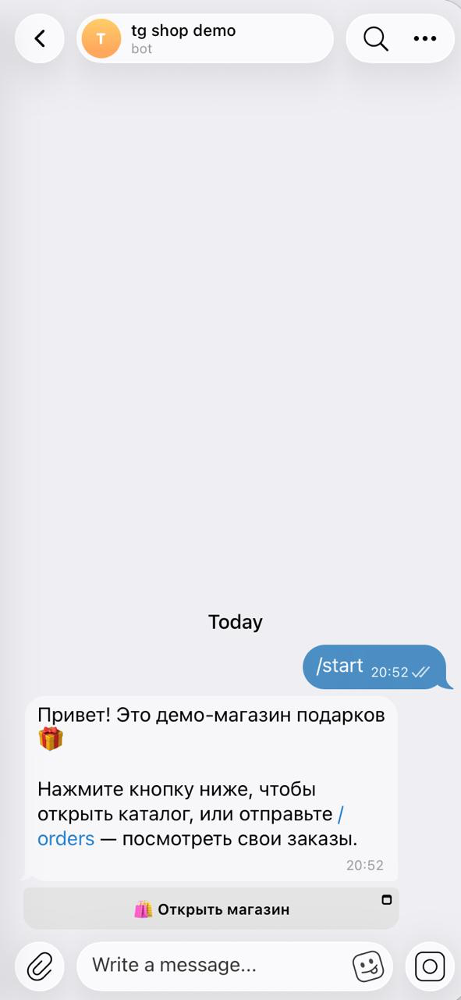
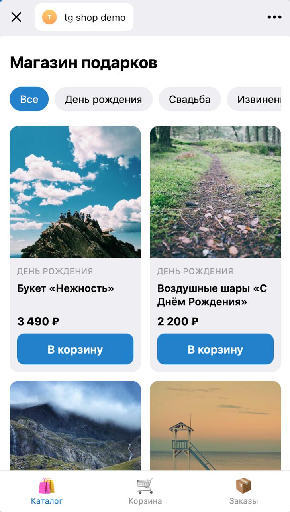
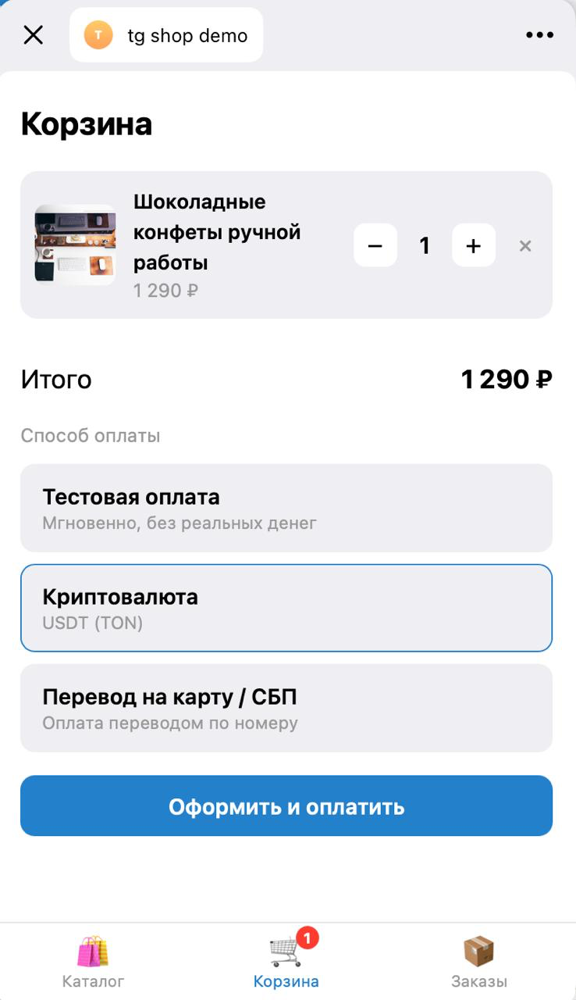
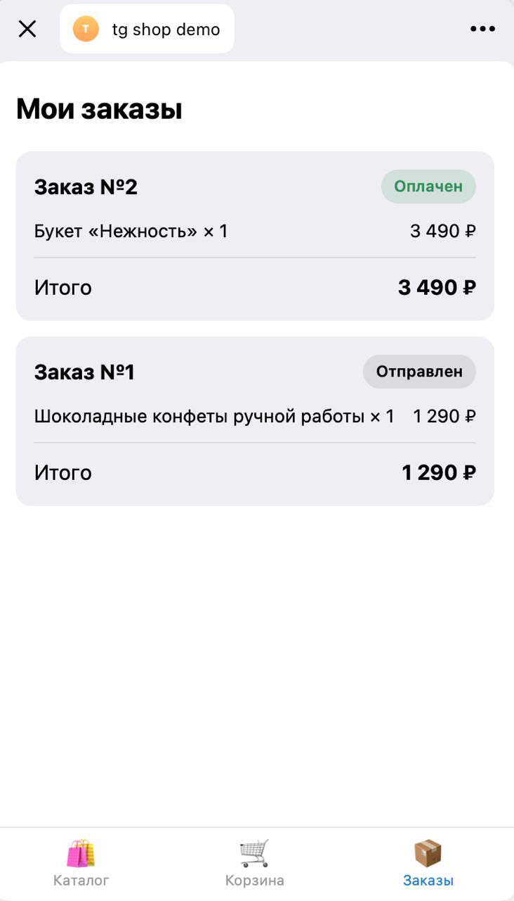
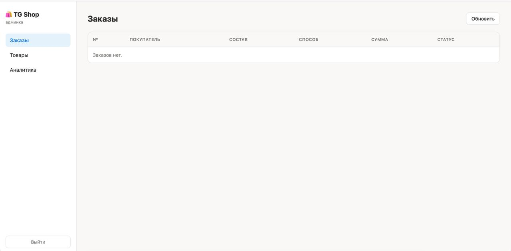
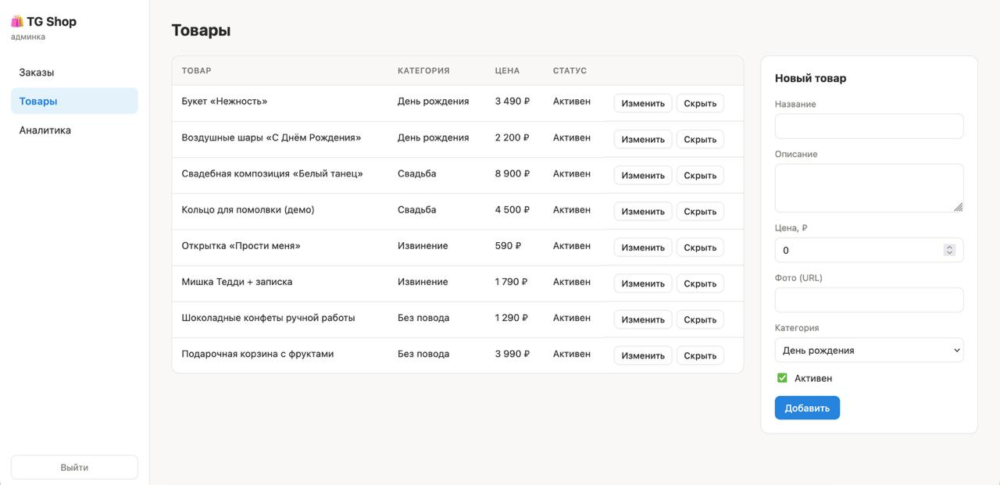
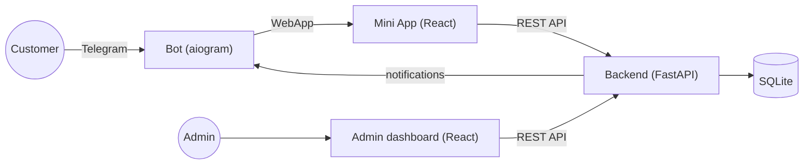

[Русский](README.md) · **English**

# 🎁 TG Shop — Telegram Mini App E-Commerce Store


A full-featured demo of an e-commerce store built entirely inside Telegram: **bot + Mini App + admin dashboard + FastAPI backend**. Complete flow from catalog browsing to checkout and order confirmation, with no dependency on a third-party payment gateway or business contract.

## 🖼️ Screenshots

**Bot & Mini App**

| Bot | Catalog | Payment | My orders |
| --- | --- | --- | --- |
|  |  |  |  |

**Admin dashboard**






## ✨ Features

- 🛒 Catalog with category filters, cart, and checkout — all inside a Telegram Mini App
- 🤖 aiogram 3 bot: opens the shop, `/orders` command, automatic order notifications
- 💳 **Three payment methods**, none requiring a third-party payment gateway:
  - **mock payment** — instant, for demos
  - **crypto (USDT)** — wallet address + QR code, manually confirmed
  - **bank card / instant transfer** — payment details + "Copy" button, manually confirmed
- 🖥️ Admin dashboard: orders with status changes, product CRUD, analytics (revenue, top products)
- 🔐 Security done right: Telegram initData validation (HMAC-SHA256), order totals always computed server-side, parameterized SQL everywhere
- 🛠️ A single `tgshop.sh` script drives the whole lifecycle: install, configure, run, build frontends

## 🧱 Tech Stack

| Component | Technologies |
| --- | --- |
| Backend | Python, FastAPI, SQLite, Pydantic Settings |
| Bot | Python, aiogram 3 |
| Mini App | React 18, Vite, TypeScript |
| Admin dashboard | React 18, Vite, TypeScript |
| Landing page | Static HTML/CSS |

## 🏗️ Architecture



A single backend serves all three surfaces and a single SQLite database. Telegram notifications are sent directly via the Bot API (no need to involve the bot process for that).

## 📁 Project Structure

```
tg-shop-demo/
├── backend/            FastAPI — API for the Mini App, dashboard, and bot
│   ├── requirements.txt
│   ├── tests/          pytest: pure logic (order totals, initData)
│   └── app/
│       ├── main.py         app assembly, CORS, /health
│       ├── config.py       reads .env (pydantic-settings)
│       ├── db.py           SQLite connection + schema init/migrations
│       ├── schema.sql      table DDL (prices stored in kopecks/cents)
│       ├── seed.py         8 demo products
│       ├── models.py       Pydantic request/response schemas
│       ├── auth.py         Telegram initData validation (HMAC-SHA256)
│       ├── deps.py         FastAPI dependencies (current user, admin)
│       ├── repository.py   all data access (parameterized SQL only)
│       ├── paymethods.py   payment method availability + instructions/QR
│       ├── notifier.py     notifications via the Telegram Bot API
│       └── routers/        products / orders / admin / internal / mock
├── bot/                aiogram 3 — /start, /orders
├── miniapp/            React + Vite — catalog, cart, checkout
├── admin/              React + Vite — dashboard
├── landing/            static "about the shop" page
├── shared/             shared TS types for miniapp and admin (Product, OrderItem)
├── docs/screenshots/   README screenshots (see checklist)
├── tgshop.sh           single project management script
├── .env.example
└── LICENSE
```

## 🚀 Quick Start

The entire project lifecycle goes through a single script, `./tgshop.sh` (run with no arguments for an interactive menu).

### Requirements

- Python 3.11+
- Node.js 20+
- (optional) [ngrok](https://ngrok.com) — to test from a phone without deploying a server
- A Telegram bot token from [@BotFather](https://t.me/BotFather)

### Setup

```bash
git clone <this-repo>
cd tg-shop-demo
chmod +x tgshop.sh

./tgshop.sh setup     # venv, backend+bot dependencies, npm install, seed the DB
./tgshop.sh config    # bot token, your Telegram ID, admin password
./tgshop.sh pay       # enable payment methods (mock / crypto / card)
```

### Running a local test from your phone (3 terminal windows)

```bash
# Window 1 — backend + bot (keep open)
./tgshop.sh dev

# Window 2 — tunnel (keep open)
./tgshop.sh ngrok

# Window 3 — build the frontends (the ngrok URL is picked up automatically)
./tgshop.sh build
```

Next, deploy `miniapp/dist`, `admin/dist`, and the `landing/` folder to [Netlify](https://app.netlify.com/drop), then register the Mini App URL:

```bash
./tgshop.sh miniapp https://your-app.netlify.app
```

...and restart `./tgshop.sh dev`. Open the bot in Telegram — `/start` will show the "Open shop" button.

### All `tgshop.sh` commands

| Command | Purpose |
| --- | --- |
| `./tgshop.sh setup` | Install dependencies, initialize the DB |
| `./tgshop.sh config` | Write `.env` (token, ID, password) |
| `./tgshop.sh dev` | Run backend + bot |
| `./tgshop.sh ngrok` | Start an ngrok tunnel to the backend |
| `./tgshop.sh build [url]` | Build the Mini App and admin dashboard against a backend URL |
| `./tgshop.sh miniapp <url>` | Save the Mini App URL into `.env` |
| `./tgshop.sh mock [on\|off]` | Toggle mock (instant test) payment |
| `./tgshop.sh pay` | Configure payment methods (mock/crypto/card) |
| `./tgshop.sh order` | Print the recommended startup order |

## ⚙️ Environment Variables

See [`.env.example`](.env.example) for the full annotated list. Key ones:

| Variable | Description |
| --- | --- |
| `BOT_TOKEN` | Bot token from @BotFather |
| `ADMIN_CHAT_ID` | Telegram ID of the admin |
| `MINIAPP_URL` | Public Mini App URL (Netlify) |
| `API_BASE_URL` | Public backend URL |
| `ADMIN_PASSWORD` / `ADMIN_TOKEN` | Admin dashboard access |
| `INTERNAL_SECRET` | Shared secret between the bot and backend for `/api/internal/*` |
| `PAYMENTS_MOCK` | Enable the instant mock payment method |
| `CRYPTO_ADDRESS` / `CRYPTO_NETWORK` | Crypto wallet for USDT payments |
| `CARD_DETAILS` | Bank card / instant-transfer details |

## 💳 Payment Methods

The project is deliberately not tied to any specific payment gateway — all three methods are configured via `.env`, and the buyer picks one in the cart:

1. **Mock payment** (`PAYMENTS_MOCK=true`) — opening the confirmation link instantly marks the order as paid. Demo only.
2. **Crypto (USDT)** — shows the wallet address and a QR code (correctly scannable by crypto wallet apps).
3. **Bank card / instant transfer** — shows the payment details as text (no QR — banking apps don't recognize a QR code containing a phone/card number as a payable QR), plus a "Copy" button.

For methods 2 and 3, confirmation is manual: the buyer taps "I've paid" → the admin gets a Telegram notification → the admin verifies the payment arrived and marks the order "Paid" in the dashboard. This is a deliberate, sensible choice for a small shop without a bank/blockchain integration.

## ☁️ Deployment

- **`miniapp/`, `admin/`, `landing/`** — static, deploy to [Netlify](https://netlify.com) (or any static host). `./tgshop.sh build <url>` builds `miniapp/dist` and `admin/dist`.
- **`backend/`, `bot/`** — long-running processes; need a VPS/server with HTTPS (e.g. `uvicorn` behind nginx + systemd). For local phone testing, ngrok works well (see Quick Start).

## 🔒 Security

- Order totals are always computed **server-side** from DB prices — the client is never trusted.
- Telegram `initData` is verified via HMAC-SHA256 against `BOT_TOKEN`, plus an `auth_date` freshness check.
- All SQL is parameterized — no string concatenation.
- All secrets live only in `.env`; only `.env.example` is committed.
- Admin endpoints are protected by a dedicated token (`ADMIN_TOKEN`); the bot's internal API call is protected by a separate secret (`INTERNAL_SECRET`).
- Frontends only know `VITE_API_URL` — no secrets ever ship in the client bundle.

## 🧪 Tests

```bash
cd backend
source ../.venv/bin/activate
pip install pytest
pytest
```

Tests cover pure logic without FastAPI: server-side order total calculation, idempotent payment confirmation, and Telegram initData validation.

## 🧭 Ideas for Extension

- Plug in a real payment gateway (YooKassa, Stripe, etc.) as a fourth method — the `paymethods.py` architecture supports this
- Automatic on-chain verification of crypto payments via a blockchain explorer API
- Delivery tracking, fiscal receipt integration
- Product photo upload from the admin dashboard (currently URL-only)
- Multi-language Mini App

## 📄 License

[MIT](LICENSE) — use freely for your own projects and portfolio.
