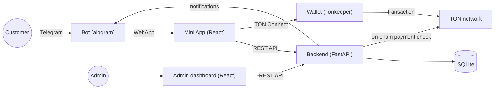

[Русский](README.md) · **English**

# 🎁 TG Shop — Telegram Mini App E-Commerce Store


A full-featured demo of an e-commerce store built entirely inside Telegram: **bot + Mini App + admin dashboard + FastAPI backend**. Complete flow from catalog browsing to checkout and order confirmation — with crypto payments straight from Telegram via **TON Connect** (TON and USDT), plus a ready Robokassa integration and manual payment options.

## 🖼️ Screenshots

**Bot & Mini App** (portrait — narrow thumbnails in a row)

| Bot | Catalog | Payment | My orders |
| --- | --- | --- | --- |
|  |  |  |  |

**Admin dashboard** (landscape — shown full-width so details stay readable)


## ✨ Features

- 🛒 Catalog with category filters, cart, and checkout — all inside a Telegram Mini App
- 🤖 aiogram 3 bot: opens the shop, `/orders` command, automatic order notifications, language chooser in `/start`
- 💳 **Payment methods for every taste** — from an instant demo to real crypto and card payments:
  - **TON Connect** — pay in **TON** straight from your wallet (Tonkeeper, etc.), confirmed **automatically** by the incoming on-chain transaction
  - **USDT (TON)** — pay with the USDT jetton on the TON network via TON Connect, also auto-confirmed
  - **Robokassa** — real gateway (card/SBP), auto-confirmed via a signed webhook
  - **mock payment** — instant, for demos
  - **crypto (USDT, manual)** — wallet address + QR code, manually confirmed (for non-TON networks, e.g. TRC20)
  - **bank card / instant transfer** — payment details + "Copy" button, manually confirmed
- 🪙 **Multi-currency storefront**: prices are stored in rubles and shown in ₽ / $ / € at live rates; the buyer picks a currency
- 🌍 **Full RU/EN localization**: Mini App, dashboard and bot messages; language follows the `/start` choice, and admin notifications arrive in the buyer's language
- 🖥️ Admin dashboard: orders with status changes, product CRUD (incl. delete), custom categories, dark theme, price input in the selected currency, analytics (revenue, top products)
- 🔗 **Single-origin hosting**: the backend can serve the built frontends itself (Mini App at root, admin at `/admin`) — no separate static host and no CORS
- 🔐 Security done right: Telegram initData validation (HMAC-SHA256), order totals always computed server-side, parameterized SQL everywhere
- 🛠️ A single `tgshop.sh` script drives the whole lifecycle: install, configure, run, build frontends

## 🧱 Tech Stack

| Component | Technologies |
| --- | --- |
| Backend | Python, FastAPI, SQLite, Pydantic Settings |
| Bot | Python, aiogram 3 |
| Mini App | React 18, Vite, TypeScript, TON Connect UI (`@tonconnect/ui-react`, `@ton/core`) |
| Admin dashboard | React 18, Vite, TypeScript |
| Payments / blockchain | TON Connect, TON, USDT (jetton), Robokassa |
| Landing page | Static HTML/CSS |

## 🏗️ Architecture



A single backend serves all three surfaces and a single SQLite database. Telegram notifications are sent directly via the Bot API (no need to involve the bot process for that). TON/USDT payments are confirmed automatically: the backend matches the incoming TON transaction by its comment tag (via TonAPI/Toncenter).

## 📁 Project Structure

```
tg-shop-demo/
├── backend/            FastAPI — API for the Mini App, dashboard, and bot
│   ├── requirements.txt
│   ├── tests/          pytest: pure logic (order totals, initData)
│   └── app/
│       ├── main.py         app assembly, CORS, /health, single-origin static
│       ├── config.py       reads .env (pydantic-settings)
│       ├── endpoints.json  external API URLs (rates, Robokassa) — kept out of code
│       ├── db.py           SQLite connection + schema init/migrations
│       ├── schema.sql      table DDL (prices stored in kopecks/cents)
│       ├── seed.py         8 demo products
│       ├── models.py       Pydantic request/response schemas
│       ├── auth.py         Telegram initData validation (HMAC-SHA256)
│       ├── deps.py         FastAPI dependencies (current user, admin)
│       ├── repository.py   all data access (parameterized SQL only)
│       ├── paymethods.py   payment method availability + instructions/QR
│       ├── rates.py        TON / USDT / fiat rates (cached, with fallbacks)
│       ├── tonpay.py       on-chain verification of incoming TON/USDT payments
│       ├── messages.py     localized bot & notification texts (RU/EN)
│       ├── notifier.py     notifications via the Telegram Bot API
│       └── routers/        products / orders / admin / internal / mock / robokassa / ton
├── bot/                aiogram 3 — /start (language chooser), /orders
├── miniapp/            React + Vite — catalog, cart, checkout, TON Connect
├── admin/              React + Vite — dashboard
├── landing/            static "about the shop" page
├── shared/             shared TS types for miniapp and admin (Product, OrderItem, Currency, Lang)
├── docs/screenshots/   README screenshots (see checklist)
├── tgshop.sh           single project management script
├── .env.example
└── LICENSE
```

## 🚀 Quick Start

The entire project lifecycle goes through a single script, `./tgshop.sh` (run with no arguments for an interactive menu).

### Requirements

- Python 3.11+
- Node.js 20+
- (optional) [ngrok](https://ngrok.com) — to test from a phone without deploying a server
- A Telegram bot token from [@BotFather](https://t.me/BotFather)
- (for TON payments) a Tonkeeper wallet and an HTTPS-reachable TON Connect manifest

### Setup

```bash
git clone <this-repo>
cd tg-shop-demo
chmod +x tgshop.sh
./tgshop.sh setup     # venv, backend+bot dependencies, npm install, seed the DB
./tgshop.sh config    # bot token, your Telegram ID, admin password
./tgshop.sh pay       # enable payment methods (mock / crypto / card)
```

### Running a local test from your phone (3 terminal windows)

```bash
# Window 1 — backend + bot (keep open)
./tgshop.sh dev
# Window 2 — tunnel (keep open)
./tgshop.sh ngrok
# Window 3 — build the frontends (the ngrok URL is picked up automatically)
./tgshop.sh build
```

Next, deploy `miniapp/dist`, `admin/dist`, and the `landing/` folder to [Netlify](https://app.netlify.com/drop), then register the Mini App URL:

```bash
./tgshop.sh miniapp https://your-app.netlify.app
```

...and restart `./tgshop.sh dev`. Open the bot in Telegram — `/start` will show the "Open shop" button.

> 💡 Don't want a separate static host? Use **single-origin**: `./tgshop.sh build` builds the frontends and the backend serves the Mini App and the admin dashboard (`/admin`) from the same origin (see "Deployment").

### All `tgshop.sh` commands

| Command | Purpose |
| --- | --- |
| `./tgshop.sh setup` | Install dependencies, initialize the DB |
| `./tgshop.sh config` | Write `.env` (token, ID, password) |
| `./tgshop.sh dev` | Run backend + bot |
| `./tgshop.sh ngrok` | Start an ngrok tunnel to the backend |
| `./tgshop.sh build [url]` | Build the Mini App and admin dashboard against a backend URL |
| `./tgshop.sh miniapp <url>` | Save the Mini App URL into `.env` |
| `./tgshop.sh mock [on\|off]` | Toggle mock (instant test) payment |
| `./tgshop.sh pay` | Configure payment methods (mock/crypto/card) |
| `./tgshop.sh robokassa` | Configure Robokassa keys |
| `./tgshop.sh order` | Print the recommended startup order |

## ⚙️ Environment Variables

See [`.env.example`](.env.example) for the full annotated list. Key ones:

| Variable | Description |
| --- | --- |
| `BOT_TOKEN` | Bot token from @BotFather |
| `ADMIN_CHAT_ID` | Telegram ID of the admin |
| `MINIAPP_URL` | Public Mini App URL (Netlify) |
| `API_BASE_URL` | Public backend URL |
| `ADMIN_PASSWORD` / `ADMIN_TOKEN` | Admin dashboard access |
| `ADMIN_LANG` | Default admin/notification language (`ru`/`en`) |
| `INTERNAL_SECRET` | Shared secret between the bot and backend for `/api/internal/*` |
| `PAYMENTS_MOCK` | Enable the instant mock payment method |
| `ROBOKASSA_LOGIN` / `ROBOKASSA_PASSWORD1` / `ROBOKASSA_PASSWORD2` | Robokassa keys (+ `ROBOKASSA_TEST=true` for test mode) |
| `TON_RECEIVE_ADDRESS` / `TON_NETWORK` | TON receiving wallet and network (`mainnet`/`testnet`) |
| `TON_MANIFEST_URL` | TON Connect manifest URL (must be HTTPS) |
| `TON_USDT_MASTER` / `TON_USDT_RECEIVE_ADDRESS` | USDT jetton master contract and USDT wallet |
| `TONAPI_API_KEY` | (optional) TonAPI key for verifying jetton transfers |
| `CRYPTO_ADDRESS` / `CRYPTO_NETWORK` | Crypto wallet for manual USDT payments (non-TON) |
| `CARD_DETAILS` | Bank card / instant-transfer details |

> External API URLs (CoinGecko rates, open.er-api, the Robokassa page) live in `backend/app/endpoints.json` — they don't need to be hardcoded and can be overridden via a same-named environment variable.

## 💳 Payment Methods

The project is not tied to any single gateway — methods are configured via `.env`, and the buyer picks one in the cart:

1. **Mock payment** (`PAYMENTS_MOCK=true`) — opening the confirmation link instantly marks the order as paid. Demo only.
2. **Robokassa** (real gateway) — redirect to the Robokassa payment page (card/SBP); confirmation is **automatic** via the Result URL (a signed webhook). Works with RF self-employed sellers; has a test mode (`ROBOKASSA_TEST=true`).
3. **TON Connect — pay in TON** — the buyer connects a wallet (Tonkeeper, etc.) right inside the Mini App and pays in TON. Confirmation is **automatic**: the backend finds the incoming TON transaction by its comment tag. The widget's theme and language follow Telegram.
4. **USDT (TON)** — pay with the USDT jetton on the TON network via the same TON Connect; confirmation is **automatic** (verifying the jetton transfer to the receiving wallet via TonAPI/Toncenter).
5. **Crypto (USDT, manual)** — wallet address + QR code (correctly scannable by crypto wallet apps), confirmed manually. For non-TON networks (e.g. TRC20).
6. **Bank card / instant transfer** — payment details as text + a "Copy" button (no QR — banking apps don't recognize a QR with a phone/card number as payable), confirmed manually.

Methods 5 and 6 are confirmed manually: the buyer taps "I've paid" → the admin gets a Telegram notification → the admin verifies and marks the order "Paid". TON Connect, USDT (TON), Robokassa and mock payments are confirmed automatically.

**Robokassa setup:** `./tgshop.sh robokassa` (writes the keys), then in the Robokassa dashboard → Technical settings set Result URL `<API_BASE_URL>/api/robokassa/result`, Success `/api/robokassa/success`, Fail `/api/robokassa/fail`.

**TON Connect setup:** set `TON_RECEIVE_ADDRESS`, `TON_NETWORK` and `TON_MANIFEST_URL` in `.env` (the manifest must be reachable over HTTPS). For USDT, also set `TON_USDT_MASTER` and, if needed, a separate `TON_USDT_RECEIVE_ADDRESS`. Verifying incoming payments is smoother with a `TONAPI_API_KEY`.

## 🌍 Localization & Currencies

- **RU/EN languages** — the Mini App, dashboard and all bot messages are translated. The language is chosen in `/start`, passed to the Mini App (`?lang=`), remembered, and overrides the Telegram language. Admin notifications arrive **in the buyer's language**.
- **Multi-currency** — prices are stored in rubles (kopecks) but displayed in ₽ / $ / € at live rates (open.er-api, cached with fallbacks). The buyer picks a currency in the storefront; in the admin panel the price can also be entered in the selected currency and is correctly converted back to rubles on save.

## ☁️ Deployment

- **`miniapp/`, `admin/`, `landing/`** — static, deploy to [Netlify](https://netlify.com) (or any static host). `./tgshop.sh build <url>` builds `miniapp/dist` and `admin/dist`.
- **Single-origin (no static host)** — the backend can serve the built frontends itself: the Mini App from the root and the admin dashboard at `/admin`. Just build (`./tgshop.sh build`) and run the backend — everything works from one origin, with no CORS and no Netlify.
- **`backend/`, `bot/`** — long-running processes; need a VPS/server with HTTPS (e.g. `uvicorn` behind nginx + systemd). For local phone testing, ngrok works well (see Quick Start).

## 🔒 Security

- Order totals are always computed **server-side** from DB prices — the client is never trusted.
- Telegram `initData` is verified via HMAC-SHA256 against `BOT_TOKEN`, plus an `auth_date` freshness check.
- TON/USDT payments are confirmed only after matching the incoming on-chain transaction (comment tag), never on the client's word.
- All SQL is parameterized — no string concatenation.
- All secrets live only in `.env`; only `.env.example` is committed.
- Admin endpoints are protected by a dedicated token (`ADMIN_TOKEN`); the bot's internal API call is protected by a separate secret (`INTERNAL_SECRET`).
- Frontends only know `VITE_API_URL` — no secrets ever ship in the client bundle.

## 🧪 Tests

```bash
cd backend
source ../.venv/bin/activate
pip install pytest
pytest
```

Tests cover pure logic without FastAPI: server-side order total calculation, idempotent payment confirmation, and Telegram initData validation.

## 🧹 Code Quality

The project passes the **aislop quality gate — 100/100, 0 warnings**: a typed config instead of hardcoded URLs (addresses moved to `endpoints.json`), no silent fallback handlers (failures are logged and surfaced in state), a single source of truth for TS types and localizations (`shared/`), and small, non-duplicated functions.

## 🧭 Ideas for Extension

- Plug in more payment gateways (YooKassa, Stripe, etc.) following the Robokassa pattern — the `paymethods.py` architecture supports this
- TonAPI webhooks/streaming instead of periodic transaction polling
- Automatic on-chain verification for non-TON crypto (e.g. TRC20)
- Delivery tracking, fiscal receipt integration
- Product photo upload from the admin dashboard (currently URL-only)

## 📄 License

[MIT](LICENSE) — use freely for your own projects and portfolio.
