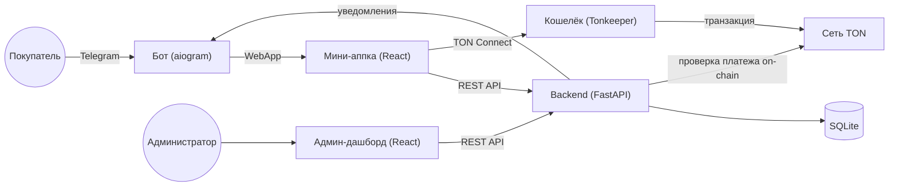

**Русский** · [English](README.en.md)

# 🎁 TG Shop — интернет-магазин в Telegram Mini App


Полноценный демо-проект интернет-магазина внутри Telegram: **бот + мини-аппка + админ-дашборд + FastAPI-бэкенд**. Полный цикл от каталога до оплаты и подтверждения заказа — с оплатой криптой прямо из Telegram через **TON Connect** (TON и USDT), а также готовой интеграцией Robokassa и ручными способами оплаты.

## 🖼️ Скриншоты

**Бот и мини-аппка** (портретные — узкие превью в ряд)

| Бот | Каталог | Оплата | Мои заказы |
| --- | --- | --- | --- |
|  |  |  |  |

**Админ-дашборд** (альбомные — во всю ширину, чтобы были видны детали)


## ✨ Возможности

- 🛒 Каталог с фильтром по категориям, корзина, оформление заказа — всё внутри Telegram Mini App
- 🤖 Бот на aiogram 3: кнопка открытия магазина, `/orders`, авто-уведомления о новых заказах, выбор языка в `/start`
- 💳 **Способы оплаты** на любой вкус — от мгновенного демо до реальной оплаты криптой и картой:
  - **TON Connect** — оплата в **TON** прямо из кошелька (Tonkeeper и др.), подтверждение **автоматически** по входящей транзакции on-chain
  - **USDT (TON)** — оплата жетоном USDT в сети TON через TON Connect, тоже с авто-подтверждением
  - **Robokassa** — реальный шлюз (карта/СБП), авто-подтверждение по подписанному вебхуку
  - **тестовая оплата** — мгновенно для демо
  - **криптовалюта (USDT, вручную)** — адрес + QR, подтверждение вручную (для сетей вне TON, напр. TRC20)
  - **перевод на карту/СБП** — реквизиты + кнопка «Копировать», подтверждение вручную
- 🪙 **Мультивалютная витрина**: цены хранятся в рублях, отображаются в ₽ / $ / € по «живым» курсам, покупатель выбирает валюту
- 🌍 **Полная локализация RU/EN**: мини-аппка, админка и сообщения бота; язык следует выбору в `/start`, а уведомления админу приходят на языке покупателя
- 🖥️ Админ-дашборд: заказы и смена статусов, CRUD товаров (в т.ч. удаление), кастомные категории, тёмная тема, ввод цены в выбранной валюте, аналитика (выручка, топ-товары)
- 🔗 **Single-origin хостинг**: бэкенд может сам отдавать собранные фронты (мини-аппку и админку на `/admin`) — без отдельного статик-хостинга и CORS
- 🔐 Проверенная безопасность: валидация Telegram initData (HMAC-SHA256), сумма заказа считается только на сервере, параметризованный SQL
- 🛠️ Один скрипт `tgshop.sh` для всего жизненного цикла: установка, настройка, запуск, сборка фронтов

## 🧱 Стек

| Компонент | Технологии |
| --- | --- |
| Backend | Python, FastAPI, SQLite, Pydantic Settings |
| Бот | Python, aiogram 3 |
| Мини-аппка | React 18, Vite, TypeScript, TON Connect UI (`@tonconnect/ui-react`, `@ton/core`) |
| Админ-дашборд | React 18, Vite, TypeScript |
| Платежи / блокчейн | TON Connect, TON, USDT (jetton), Robokassa |
| Лендинг | Статический HTML/CSS |

## 🏗️ Архитектура



Единый backend обслуживает все три поверхности и одну БД SQLite. Уведомления в Telegram отправляются напрямую через Bot API (отдельный процесс бота для этого не нужен). Оплата в TON/USDT подтверждается автоматически: бэкенд сверяет входящую транзакцию в сети TON по метке-комментарию (через TonAPI/Toncenter).

## 📁 Структура проекта

```
tg-shop-demo/
├── backend/            FastAPI — API для мини-аппки, админки и бота
│   ├── requirements.txt
│   ├── tests/          pytest: чистая логика (сумма заказа, initData)
│   └── app/
│       ├── main.py         сборка приложения, CORS, /health, single-origin статика
│       ├── config.py       чтение .env (pydantic-settings)
│       ├── endpoints.json  адреса внешних API (курсы, Robokassa) — вне кода
│       ├── db.py           SQLite + инициализация/миграции схемы
│       ├── schema.sql      DDL таблиц (цены в копейках)
│       ├── seed.py         8 демо-товаров
│       ├── models.py       Pydantic-схемы запросов/ответов
│       ├── auth.py         валидация Telegram initData (HMAC-SHA256)
│       ├── deps.py         зависимости FastAPI (текущий пользователь, админ)
│       ├── repository.py   весь доступ к данным (параметризованный SQL)
│       ├── paymethods.py   доступность способов оплаты + инструкции/QR
│       ├── rates.py        курсы TON / USDT / фиата (с кэшем и фоллбэком)
│       ├── tonpay.py       проверка входящих TON/USDT-платежей on-chain
│       ├── messages.py     локализованные тексты бота и уведомлений (RU/EN)
│       ├── notifier.py     уведомления через Telegram Bot API
│       └── routers/        products / orders / admin / internal / mock / robokassa / ton
├── bot/                aiogram 3 — /start (выбор языка), /orders
├── miniapp/            React + Vite — каталог, корзина, оплата, TON Connect
├── admin/              React + Vite — дашборд
├── landing/            статичная страница о магазине
├── shared/             общие TS-типы для miniapp и admin (Product, OrderItem, Currency, Lang)
├── docs/screenshots/   скриншоты для README (см. чек-лист)
├── tgshop.sh           единый скрипт управления проектом
├── .env.example
└── LICENSE
```

## 🚀 Быстрый старт

Весь жизненный цикл проекта — через единый скрипт `./tgshop.sh` (запуск без аргументов покажет интерактивное меню).

### Требования

- Python 3.11+
- Node.js 20+
- (опционально) [ngrok](https://ngrok.com) — для теста с телефона без деплоя на сервер
- Токен Telegram-бота от [@BotFather](https://t.me/BotFather)
- (для оплаты в TON) кошелёк Tonkeeper и HTTPS-доступный манифест TON Connect

### Установка

```bash
git clone <this-repo>
cd tg-shop-demo
chmod +x tgshop.sh
./tgshop.sh setup     # venv, зависимости backend+bot, npm install, сид БД
./tgshop.sh config    # токен бота, Telegram ID, пароль админки
./tgshop.sh pay       # включить способы оплаты (тест / крипта / карта)
```

### Запуск для теста с телефона (3 окна терминала)

```bash
# Окно 1 — backend + бот (держать открытым)
./tgshop.sh dev
# Окно 2 — туннель (держать открытым)
./tgshop.sh ngrok
# Окно 3 — собрать фронты (адрес ngrok подхватится автоматически)
./tgshop.sh build
```

Дальше: залей `miniapp/dist`, `admin/dist` и папку `landing/` на [Netlify](https://app.netlify.com/drop), впиши адрес мини-аппки:

```bash
./tgshop.sh miniapp https://твой-адрес.netlify.app
```

и перезапусти `./tgshop.sh dev`. Открой бота в Telegram — `/start` покажет кнопку открытия магазина.

> 💡 Не хочешь отдельный статик-хостинг? Используй **single-origin**: `./tgshop.sh build` соберёт фронты, а бэкенд сам отдаст мини-аппку и админку (`/admin`) с того же адреса (см. «Деплой»).

### Все команды `tgshop.sh`

| Команда | Назначение |
| --- | --- |
| `./tgshop.sh setup` | Установить зависимости, создать БД |
| `./tgshop.sh config` | Записать `.env` (токен, ID, пароль) |
| `./tgshop.sh dev` | Запустить backend + бота |
| `./tgshop.sh ngrok` | Запустить ngrok-туннель на backend |
| `./tgshop.sh build [url]` | Собрать мини-аппку и админку под адрес бэкенда |
| `./tgshop.sh miniapp <url>` | Записать адрес мини-аппки в `.env` |
| `./tgshop.sh mock [on\|off]` | Включить/выключить тестовую оплату |
| `./tgshop.sh pay` | Настроить способы оплаты (тест/крипта/карта) |
| `./tgshop.sh robokassa` | Настроить ключи Robokassa |
| `./tgshop.sh order` | Показать рекомендованный порядок запуска |

## ⚙️ Переменные окружения

Полный список с комментариями — в [`.env.example`](.env.example). Основные:

| Переменная | Описание |
| --- | --- |
| `BOT_TOKEN` | Токен бота из @BotFather |
| `ADMIN_CHAT_ID` | Telegram ID администратора |
| `MINIAPP_URL` | Публичный URL мини-аппки (Netlify) |
| `API_BASE_URL` | Публичный URL backend |
| `ADMIN_PASSWORD` / `ADMIN_TOKEN` | Доступ в админ-дашборд |
| `ADMIN_LANG` | Язык админки/уведомлений по умолчанию (`ru`/`en`) |
| `INTERNAL_SECRET` | Общий секрет бота и backend для `/api/internal/*` |
| `PAYMENTS_MOCK` | Включить тестовую мгновенную оплату |
| `ROBOKASSA_LOGIN` / `ROBOKASSA_PASSWORD1` / `ROBOKASSA_PASSWORD2` | Ключи Robokassa (+ `ROBOKASSA_TEST=true` для теста) |
| `TON_RECEIVE_ADDRESS` / `TON_NETWORK` | Кошелёк-получатель TON и сеть (`mainnet`/`testnet`) |
| `TON_MANIFEST_URL` | URL манифеста TON Connect (обязательно HTTPS) |
| `TON_USDT_MASTER` / `TON_USDT_RECEIVE_ADDRESS` | Мастер-контракт USDT-жетона и кошелёк для USDT |
| `TONAPI_API_KEY` | (опц.) ключ TonAPI для проверки jetton-переводов |
| `CRYPTO_ADDRESS` / `CRYPTO_NETWORK` | Криптокошелёк для ручной оплаты USDT (вне TON) |
| `CARD_DETAILS` | Реквизиты для перевода на карту/СБП |

> Адреса внешних API (курсы CoinGecko, open.er-api, страница Robokassa) вынесены в `backend/app/endpoints.json` — их не нужно хардкодить в коде, при желании переопределяются одноимённой переменной окружения.

## 💳 Способы оплаты

Проект не привязан к одному шлюзу — способы настраиваются через `.env`, покупатель выбирает способ в корзине:

1. **Тестовая оплата** (`PAYMENTS_MOCK=true`) — открытие ссылки сразу помечает заказ оплаченным. Только для демо.
2. **Robokassa** (реальный шлюз) — редирект на страницу оплаты (карта/СБП), подтверждение **автоматическое** через Result URL (вебхук с проверкой подписи). Работает с самозанятыми РФ, есть тестовый режим (`ROBOKASSA_TEST=true`).
3. **TON Connect — оплата в TON** — покупатель подключает кошелёк (Tonkeeper и др.) прямо в мини-аппке и платит в TON. Подтверждение **автоматическое**: бэкенд находит входящую транзакцию в сети TON по метке-комментарию. Тема и язык виджета следуют Telegram.
4. **USDT (TON)** — оплата жетоном USDT в сети TON через тот же TON Connect; подтверждение **автоматическое** (проверка jetton-перевода на кошелёк-получатель через TonAPI/Toncenter).
5. **Криптовалюта (USDT, вручную)** — адрес кошелька + QR (его корректно сканируют крипто-кошельки), подтверждение вручную. Для сетей вне TON (напр. TRC20).
6. **Перевод на карту/СБП** — реквизиты текстом + кнопка «Скопировать» (без QR — банки не распознают QR с номером как платёжный), подтверждение вручную.

Способы 5 и 6 подтверждаются вручную: покупатель нажимает «Я оплатил» → админу приходит уведомление → админ меняет статус на «Оплачен». TON Connect, USDT (TON), Robokassa и тестовая оплата подтверждаются автоматически.

**Настройка Robokassa:** `./tgshop.sh robokassa` (впишет ключи), затем в ЛК Robokassa → Технические настройки укажи Result URL `<API_BASE_URL>/api/robokassa/result`, Success `/api/robokassa/success`, Fail `/api/robokassa/fail`.

**Настройка TON Connect:** укажи в `.env` `TON_RECEIVE_ADDRESS`, `TON_NETWORK` и `TON_MANIFEST_URL` (манифест должен быть доступен по HTTPS). Для USDT дополнительно задай `TON_USDT_MASTER` и, при необходимости, отдельный `TON_USDT_RECEIVE_ADDRESS`. Проверять поступления удобнее с `TONAPI_API_KEY`.

## 🌍 Локализация и валюты

- **Языки RU/EN** — переведены мини-аппка, админка и все сообщения бота. Язык выбирается в `/start`, прокидывается в мини-аппку (`?lang=`), запоминается и переопределяет язык Telegram. Уведомления администратору приходят **на языке покупателя**.
- **Мультивалютность** — цены хранятся в рублях (копейках), а отображаются в ₽ / $ / € по «живым» курсам (open.er-api, с кэшем и запасными значениями). Покупатель выбирает валюту в витрине; в админке цену тоже можно вводить в выбранной валюте — она корректно пересчитывается в рубли при сохранении.

## ☁️ Деплой

- **`miniapp/`, `admin/`, `landing/`** — статика, деплой на [Netlify](https://netlify.com) (или любом статик-хостинге). `./tgshop.sh build <url>` собирает `miniapp/dist` и `admin/dist`.
- **Single-origin (без статик-хостинга)** — бэкенд может сам раздавать собранные фронты: мини-аппку с корня и админку на `/admin`. Достаточно собрать (`./tgshop.sh build`) и запустить backend — всё работает с одного адреса, без CORS и Netlify.
- **`backend/`, `bot/`** — постоянно работающие процессы, нужен VPS/сервер с HTTPS (например, `uvicorn` за nginx + systemd). Для локального теста с телефона подходит ngrok (см. «Быстрый старт»).

## 🔒 Безопасность

- Сумма заказа всегда считается **на сервере** по ценам из БД — клиенту не доверяем.
- Telegram `initData` проверяется по HMAC-SHA256 по `BOT_TOKEN` + проверка свежести `auth_date`.
- Оплата в TON/USDT подтверждается только после сверки входящей транзакции в сети TON (метка-комментарий), а не по слову клиента.
- Весь SQL — только параметризованные запросы (без склейки строк).
- Все секреты — только в `.env`, в репозитории только `.env.example`.
- Админские эндпоинты защищены отдельным токеном (`ADMIN_TOKEN`), а внутренний API бота — отдельным секретом (`INTERNAL_SECRET`).
- Фронтенды знают только `VITE_API_URL` — секреты в бандл не попадают.

## 🧪 Тесты

```bash
cd backend
source ../.venv/bin/activate
pip install pytest
pytest
```

Тесты проверяют чистую логику без FastAPI: серверный расчёт суммы заказа, идемпотентность подтверждения оплаты, валидацию Telegram initData.

## 🧹 Качество кода

Проект проходит квалити-гейт **aislop — 100/100, 0 warnings**: типизированный конфиг вместо хардкод-URL (адреса вынесены в `endpoints.json`), никаких «немых» fallback-обработчиков (сбои логируются и отражаются в состоянии), единый источник TS-типов и локализаций (`shared/`), небольшие функции без дублирования.

## 🧭 Идеи для развития

- Подключение других платёжных шлюзов (ЮKassa, Stripe и т.д.) по образцу Robokassa — архитектура `paymethods.py` это позволяет
- Вебхуки/стриминг TonAPI вместо периодической сверки транзакций
- Автоматическая проверка поступления для крипты вне TON (напр. TRC20)
- Отслеживание доставки, интеграция с СДЭК
- Загрузка фото товаров из админки (сейчас — только URL)

## 📄 Лицензия

[MIT](LICENSE) — используйте свободно для своих проектов и портфолио.
