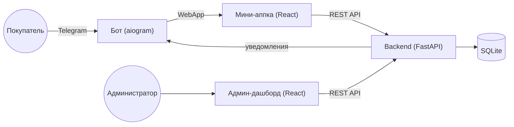

**Русский** · [English](README.en.md)

# 🎁 TG Shop — интернет-магазин в Telegram Mini App


Полноценный демо-проект интернет-магазина внутри Telegram: **бот + мини-аппка + админ-дашборд + FastAPI-бэкенд**. Полный цикл от каталога до оплаты и подтверждения заказа, без сторонних платёжных шлюзов и договоров.

## 🖼️ Скриншоты

**Бот и мини-апп**

| Бот | Каталог | Оплата | Мои заказы |
| --- | --- | --- | --- |
|  |  |  |  |

**Админ-дашборд**


## ✨ Возможности

- 🛒 Каталог с фильтром по категориям, корзина, оформление заказа — всё внутри Telegram Mini App
- 🤖 Бот на aiogram 3: кнопка открытия магазина, `/orders`, авто-уведомления о новых заказах
- 💳 **Три способа оплаты** без подключения внешних платёжных шлюзов:
  - **тестовая оплата** — мгновенно для демо
  - **криптовалюта (USDT)** — адрес + QR, подтверждение вручную
  - **перевод на карту/СБП** — реквизиты + кнопка «Копировать», подтверждение вручную
- 🖥️ Админ-дашборд: заказы и смена статусов, CRUD товаров, аналитика (выручка, топ-товары)
- 🔐 Проверенная безопасность: валидация Telegram initData (HMAC-SHA256), сумма заказа считается только на сервере, параметризованный SQL
- 🛠️ Один скрипт `tgshop.sh` для всего жизненного цикла: установка, настройка, запуск, сборка фронтов

## 🧱 Стек

| Компонент | Технологии |
| --- | --- |
| Backend | Python, FastAPI, SQLite, Pydantic Settings |
| Бот | Python, aiogram 3 |
| Мини-аппка | React 18, Vite, TypeScript |
| Админ-дашборд | React 18, Vite, TypeScript |
| Лендинг | Статический HTML/CSS |

## 🏗️ Архитектура



Единый backend обслуживает все три поверхности и одну БД SQLite. Уведомления в Telegram отправляются напрямую через Bot API (отдельный процесс бота для этого не нужен).

## 📁 Структура проекта

```
tg-shop-demo/
├── backend/            FastAPI — API для мини-аппки, админки и бота
│   ├── requirements.txt
│   ├── tests/          pytest: чистая логика (сумма заказа, initData)
│   └── app/
│       ├── main.py         сборка приложения, CORS, /health
│       ├── config.py       чтение .env (pydantic-settings)
│       ├── db.py           SQLite + инициализация/миграции схемы
│       ├── schema.sql      DDL таблиц (цены в копейках)
│       ├── seed.py         8 демо-товаров
│       ├── models.py       Pydantic-схемы запросов/ответов
│       ├── auth.py         валидация Telegram initData (HMAC-SHA256)
│       ├── deps.py         зависимости FastAPI (текущий пользователь, админ)
│       ├── repository.py   весь доступ к данным (параметризованный SQL)
│       ├── paymethods.py   ��оступность способов оплаты + инструкции/QR
│       ├── notifier.py     уведомления через Telegram Bot API
│       └── routers/        products / orders / admin / internal / mock
├── bot/                aiogram 3 — /start, /orders
├── miniapp/            React + Vite — каталог, корзина, оплата
├── admin/              React + Vite — дашборд
├── landing/            статичная страница о магазине
├── shared/             общие TS-типы для miniapp и admin (Product, OrderItem)
├── docs/screenshots/   скриншоты для README (см. чек-лист)
├── tgshop.sh           единый скрипт управления проектом
├── .env.example
└── LICENSE
```

## 🚀 Быстрый старт

Весь жизненный цикл проекта — через единый скрипт `./tgshop.sh` (запуск без аргументов покажет интерактивное меню).

### Требования

- Python 3.11+
- Node.js 20+
- (опционально) [ngrok](https://ngrok.com) — для теста с телефона без деплоя на сервер
- Токен Telegram-бота от [@BotFather](https://t.me/BotFather)

### Установка

```bash
git clone <this-repo>
cd tg-shop-demo
chmod +x tgshop.sh

./tgshop.sh setup     # venv, зависимости backend+bot, npm install, сид БД
./tgshop.sh config    # токен бота, Telegram ID, пароль админки
./tgshop.sh pay       # включить способы оплаты (тест / крипта / карта)
```

### Запуск для теста с телефона (3 окна терминала)

```bash
# Окно 1 — backend + бот (держать открытым)
./tgshop.sh dev

# Окно 2 — туннель (держать открытым)
./tgshop.sh ngrok

# Окно 3 — собрать фронты (адрес ngrok подхватится автоматически)
./tgshop.sh build
```

Дальше: залей `miniapp/dist`, `admin/dist` и папку `landing/` на [Netlify](https://app.netlify.com/drop), впиши адрес мини-аппки:

```bash
./tgshop.sh miniapp https://твой-адрес.netlify.app
```

и перезапусти `./tgshop.sh dev`. Открой бота в Telegram — `/start` покажет кнопку открытия магазина.

### Все команды `tgshop.sh`

| Команда | Назначение |
| --- | --- |
| `./tgshop.sh setup` | Установить зависимости, создать БД |
| `./tgshop.sh config` | Записать `.env` (токен, ID, пароль) |
| `./tgshop.sh dev` | Запустить backend + бота |
| `./tgshop.sh ngrok` | Запустить ngrok-туннель на backend |
| `./tgshop.sh build [url]` | Собрать мини-аппку и админку под адрес бэкенда |
| `./tgshop.sh miniapp <url>` | Записать адрес мини-аппки в `.env` |
| `./tgshop.sh mock [on\|off]` | Включить/выключить тестовую оплату |
| `./tgshop.sh pay` | Настроить способы оплаты (тест/крипта/карта) |
| `./tgshop.sh order` | Показать рекомендованный порядок запуска |

## ⚙️ Переменные окружения

Полный список с комментариями — в [`.env.example`](.env.example). Основные:

| Переменная | Описание |
| --- | --- |
| `BOT_TOKEN` | Токен бота из @BotFather |
| `ADMIN_CHAT_ID` | Telegram ID администратора |
| `MINIAPP_URL` | Публичный URL мини-аппки (Netlify) |
| `API_BASE_URL` | Публичный URL backend |
| `ADMIN_PASSWORD` / `ADMIN_TOKEN` | Доступ в админ-дашборд |
| `INTERNAL_SECRET` | Общий секрет бота и backend для `/api/internal/*` |
| `PAYMENTS_MOCK` | Включить тестовую мгновенную оплату |
| `CRYPTO_ADDRESS` / `CRYPTO_NETWORK` | Криптокошелёк для оплаты USDT |
| `CARD_DETAILS` | Реквизиты для перевода на карту/СБП |

## 💳 Способы оплаты

Проект намеренно не привязан к конкретному платёжному шлюзу — все три способа настраиваются через `.env`, покупатель выбирает способ в корзине:

1. **Тестовая оплата** (`PAYMENTS_MOCK=true`) — открытие ссылки сразу помечает заказ оплаченным. Только для демо.
2. **Криптовалюта (USDT)** — показывается адрес кошелька и QR-код (его корректно сканируют крипто-кошельки).
3. **Перевод на карту/СБП** — показываются реквизиты текстом (без QR — банковские приложения не распознают QR с номером как платёжный), есть кнопка «Скопировать».

Для способов 2 и 3 подтверждение — ручное: покупатель нажимает «Я оплатил» → админу приходит уведомление в Telegram → админ проверяет поступление и меняет статус заказа на «Оплачен» в дашборде. Это осознанный выбор для небольшого магазина без интеграции с банком/блокчейном.

## ☁️ Деплой

- **`miniapp/`, `admin/`, `landing/`** — статика, деплой на [Netlify](https://netlify.com) (или любом статик-хостинге). `./tgshop.sh build <url>` собирает `miniapp/dist` и `admin/dist`.
- **`backend/`, `bot/`** — постоянно работающие процессы, нужен VPS/сервер с HTTPS (например, `uvicorn` за nginx + systemd). Для локального теста с телефона подходит ngrok (см. «Быстрый старт»).

## 🔒 Безопасность

- Сумма заказа всегда считается **на сервере** по ценам из БД — клиенту не доверяем.
- Telegram `initData` проверяется по HMAC-SHA256 по `BOT_TOKEN` + проверка свежести `auth_date`.
- Весь SQL — только параметризованные запросы (без склейки строк).
- Все секреты — только в `.env`, в репозитории только `.env.example`.
- Админские эндпоинты защищены отдельным токеном (`ADMIN_TOKEN`), а внутренний API бота — отдельным секретом (`INTERNAL_SECRET`).
- Фронтенды знают только `VITE_API_URL` — секреты в бандл не попадают.

## 🧪 Тесты

```bash
cd backend
source ../.venv/bin/activate
pip install pytest
pytest
```

Тесты проверяют чистую логику без FastAPI: серверный расчёт суммы заказа, идемпотентность подтверждения оплаты, валидацию Telegram initData.

## 🧭 Идеи для развития

- Подключение реального платёжного шлюза (ЮKassa, Robokassa и т.д.) как четвёртого способа оплаты — архитектура `paymethods.py` это позволяет
- Автоматическая проверка поступления криптоплатежей через API блокчейн-обозревателя
- Отслеживание доставки, интеграция с СДЭК
- Загрузка фото товаров из админки (сейчас — только URL)
- Мультиязычность мини-аппки

## 📄 Лицензия

[MIT](LICENSE) — используйте свободно для своих проектов и портфолио.
